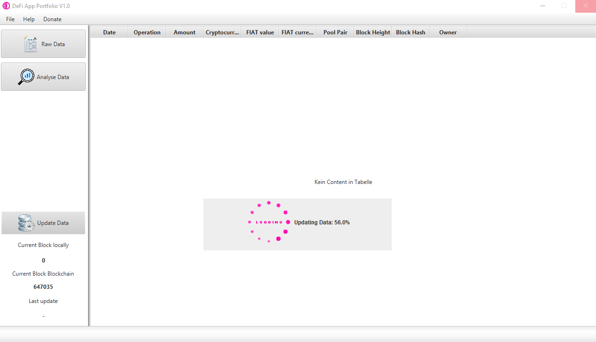
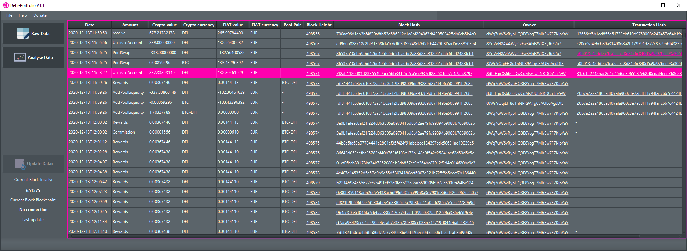
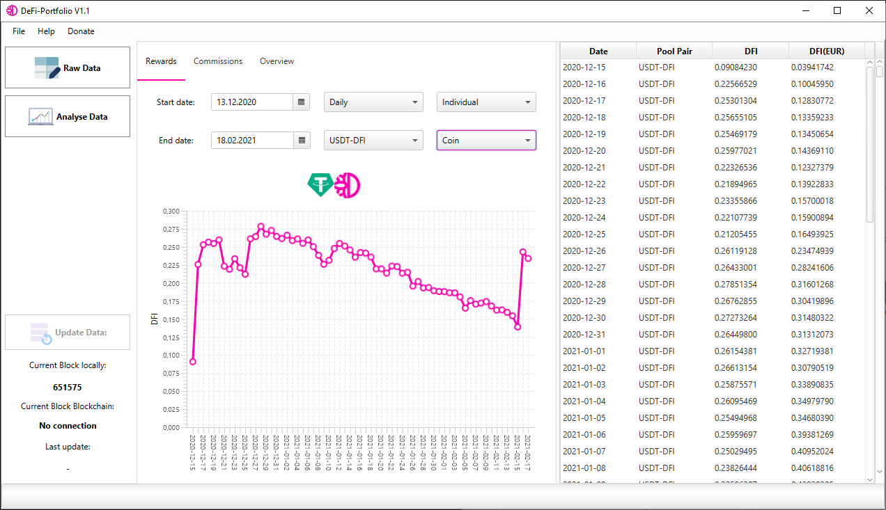
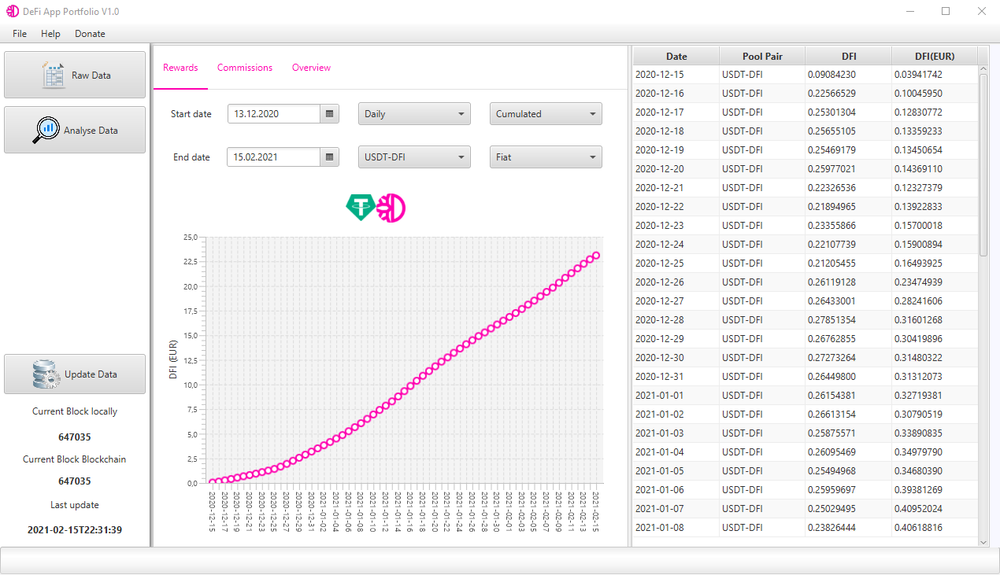
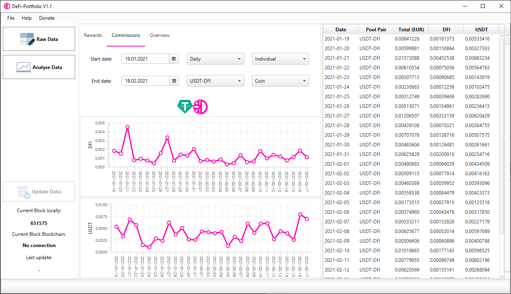
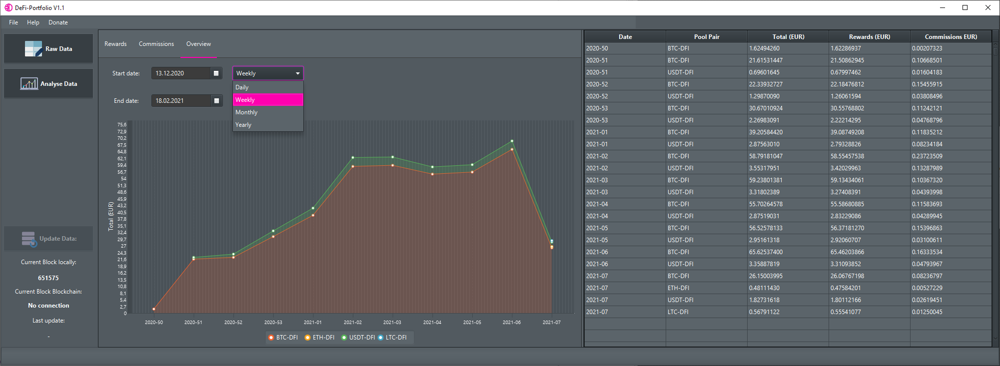
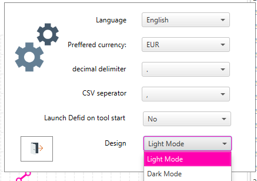

# DeFi-Portfolio

Use DeFi-Portfolio to export, analyse and visualize your transactions, rewards and commissions of your liquidity mining pools or DEX transactionsto interact with DeFiChain. 

# Documentation

- [Getting started](#getting-started)
- [Functionality description:](#functionality-description)
- [About Us](#about-us)

# Donate

If you like this application you can support this project with DFI (DefiChain token):

$DFI: dMswTqWd43S9Yu1m4LiX3QYPL2BAs7d37V
 

# Getting Started
Setup:
  1. [Download](https://www.java.com/de/download/) the Java Runtime Environment (64 bit) and install it (important to use the 64 bit version).
  2. [Download](https://github.com/DeFi-PortfolioManagement/defi-portfoliomanager/releases/latest/download/defi-portfolio.exe) the defi-portfolio-Setup-vX.X.X.exe 
  3. Install
  4. Run the Defi-Portfolio.exe
  5. The defid.exe will start. If you want to Update your data you will need. (You can also close and start it manually)
  6. Click on update database (left bottom corner)
  7. Now your big data will imported and you can look on the raw data, export them or analyse your rewards and commissions.
  8. After closing close the defid.exe. (If not then maybe you need a full resync the next time)
  
# Functionality description:
Update Database:

Before you can analyse your rewards and commissions the database must be updated. With the update database button the transactions will be read out and saved locally (appdata).
Note: The button update database will be enabled once the defid.exe has a connection to the blockchain.

Raw Data:

All transactions are shown here in tabular form. When clicking on Blockheight, Blockhash, Owner or Transaction-Hash the Blockchain Explorer will be opened with the respective value.
The table can be exported as a csv file. To do this, right-click on the corresponding sub-functions.

Analyse Data:

Here the rewards are displayed in graphical form. You can choose the start date and the end date. In addition, the interval (daily, weekly, monthly, yearly) can be selected and the pool share can be choosen. The plot can be switched between individual and cumulative view. The table can be exported as a csv file. To do this, right-click on the corresponding sub-functions.

Here the commissions are displayed in graphical form. The setting options are the same as for rewards. You can select the start date and the end date. In addition, the interval (daily, weekly, monthly, yearly) can be selected and the pool share can be choosen. The plot can be switched between individual and cumulative view. 

Here the overview is displayed in graphical form. The rewards and commissions are combined in one plot. You can choose the start date and the end date.You can also select the interval (daily, weekly, monthly, yearly).

Settings:

# About Us
Daniel Klaiber (https://t.me/danielklaiber) & (https://twitter.com/danielkolibri)

Arthur Eisener (https://t.me/ArthurEisener) & (https://twitter.com/ArthurEisener)

## Licenses

The DeFi-Portfolio is released under the terms of the MIT license. For more information see https://opensource.org/licenses/MIT.
